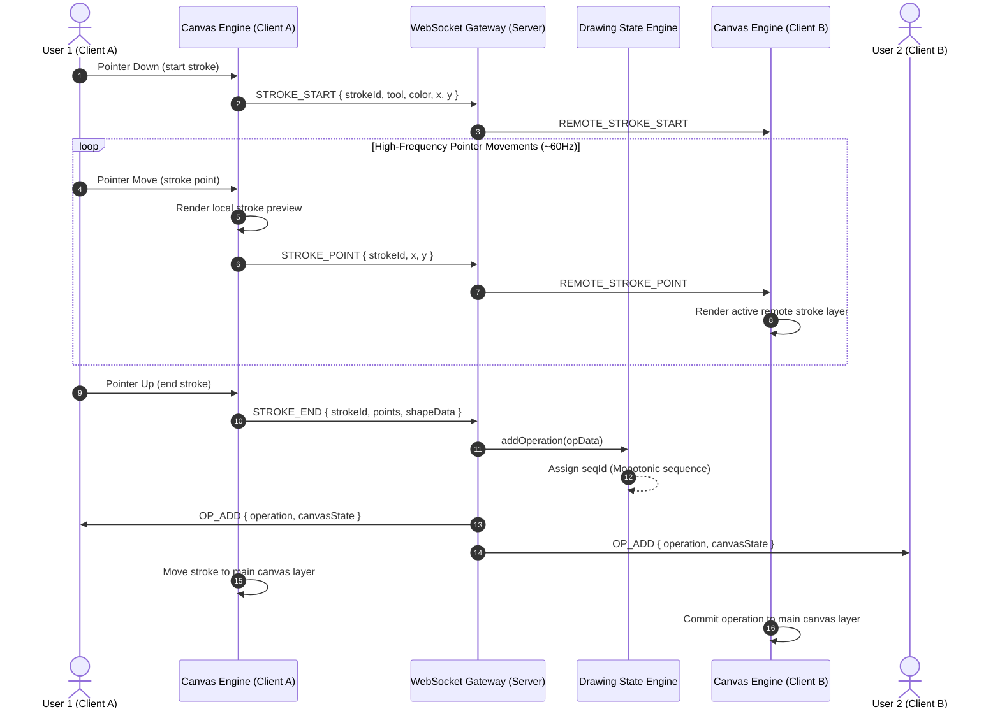

# 🏗️ CoDraw Technical Architecture & Design Document

This document provides an in-depth breakdown of the technical design, real-time WebSocket messaging protocol, global state synchronization model, canvas rendering optimizations, and conflict resolution strategies powering **CoDraw**.

---

## 1. Data Flow Architecture

The data flow diagram below illustrates how mouse/touch inputs are processed, transmitted over native WebSockets, synchronized by the server state engine, and rendered onto multi-layer HTML5 canvases across connected clients.



---

## 2. WebSocket Protocol Specification

All communication between client and server occurs over full-duplex RFC 6455 WebSockets using JSON message frames formatted as `{ type: string, payload: object }`.

| Message Type | Direction | Payload Schema | Description |
| :--- | :--- | :--- | :--- |
| `JOIN_ROOM` | Client ➔ Server | `{ roomId: string, username?: string }` | Client requests to join a room. |
| `ROOM_JOINED` | Server ➔ Client | `{ user: User, roomId: string, onlineUsers: User[], canvasState: Snapshot }` | Acknowledgement with assigned user color, name, online list, & canvas state. |
| `USER_JOINED` | Server ➔ Broadcast | `{ user: User, onlineUsers: User[] }` | Notifies room members of a newly joined user. |
| `USER_LEFT` | Server ➔ Broadcast | `{ userId: string, username: string, onlineUsers: User[] }` | Notifies room members when a user disconnects. |
| `CURSOR_MOVE` | Client ➔ Server ➔ Broadcast | `{ x: number, y: number }` | Transmits mouse cursor position (throttled at ~40Hz). |
| `USER_CURSOR` | Server ➔ Broadcast | `{ userId: string, username: string, color: string, x: number, y: number }` | Updates position of floating user cursor flags on clients. |
| `STROKE_START` | Client ➔ Server ➔ Broadcast | `{ strokeId: string, tool: string, color: string, strokeWidth: number, x: number, y: number }` | Initiates an in-flight live stroke preview. |
| `STROKE_POINT` | Client ➔ Server ➔ Broadcast | `{ strokeId: string, x: number, y: number }` | Incremental stroke point delta streamed frame-by-frame. |
| `STROKE_END` | Client ➔ Server | `{ strokeId: string, tool: string, color: string, strokeWidth: number, points: Point[], shapeData?: Shape }` | Finalizes stroke; server commits operation to history. |
| `OP_ADD` | Server ➔ Broadcast | `{ operation: Operation, canvasState: Snapshot }` | Broadcasts committed operation to all room clients. |
| `UNDO` | Client ➔ Server | `{ mode: 'global' \| 'user' }` | Requests undo of the last active operation. |
| `OP_UNDO` | Server ➔ Broadcast | `{ undoneOpId: string, undoneBy: string, canvasState: Snapshot }` | Instructs clients to update history stack and re-render canvas. |
| `REDO` | Client ➔ Server | `{ mode: 'global' \| 'user' }` | Requests redo of the last undone operation. |
| `OP_REDO` | Server ➔ Broadcast | `{ redoneOpId: string, redoneBy: string, canvasState: Snapshot }` | Instructs clients to restore operation and re-render. |
| `CLEAR_CANVAS` | Client ➔ Server ➔ Broadcast | `{ clearedBy: string, canvasState: Snapshot }` | Clears all history operations for the current room. |
| `PING` / `PONG` | Bi-directional | `{ timestamp: number }` | Heartbeat probe measuring network round-trip latency (ms). |

---

## 3. Global Multi-User Undo / Redo Strategy

Handling **Global Undo/Redo across multiple concurrent users** is one of the most complex challenges in real-time collaboration. Simple stack pops (`history.pop()`) fail because User A undoing an action after User B has drawn would destroy User B's drawing or cause state desynchronization.

### Core Undo/Redo Architecture:
1. **Server-Authoritative Operation History Log**:
   - Every completed stroke or shape operation is stored as an immutable record in `DrawingState.operations`:
     ```js
     {
       id: "op_1726054800000_a8f9b2",
       seqId: 42,                // Monotonic sequence number
       userId: "user_9912",
       username: "Swift Lynx",
       tool: "brush",
       color: "#FF5733",
       strokeWidth: 5,
       points: [{x: 100, y: 100}, {x: 120, y: 120}],
       isUndone: false           // Tombstone flag
     }
     ```

2. **Action Tombstoning (Soft Deletion)**:
   - When a user triggers **Undo**, the server does *not* delete the operation from the array. Instead, it searches backward for the last active operation (`isUndone === false`) and flips its tombstone flag to `isUndone = true`.
   - When **Redo** is triggered, the server finds the latest undone operation (`isUndone === true`) and flips `isUndone = false`.

3. **Deterministic Canvas Re-rendering**:
   - Upon receiving an `OP_UNDO` or `OP_REDO` event, all connected clients clear their main canvas layer and replay all operations where `isUndone === false` in strict `seqId` order.
   - Eraser strokes (`tool: 'eraser'`) use `globalCompositeOperation = 'destination-out'` during playback, ensuring proper vector masks and layering without corrupting previous strokes.

---

## 4. Canvas Performance & Optimization Decisions

### A. Multi-Layer Canvas Stack
Instead of executing expensive full-canvas redraws on every mouse move, CoDraw uses **3 separate layered DOM elements**:
1. `#main-canvas` (z-index 1): Renders static, finalized operations from history. Only re-renders when history changes (Undo/Redo/Clear/OpAdd).
2. `#active-canvas` (z-index 2): Renders active in-flight strokes for local pointer movement and remote users. Cleared on stroke completion.
3. `#cursor-overlay` (z-index 3): Hardware-accelerated CSS `transform: translate3d()` overlay rendering remote user cursor pointers without invoking Canvas 2D context operations.

### B. Quadratic Bezier Curve Path Smoothing
Raw mouse movement events can feel jagged. CoDraw computes midpoints between consecutive coordinates and uses **Quadratic Bezier curves** (`ctx.quadraticCurveTo(controlX, controlY, endX, endY)`) to generate butter-smooth brush strokes even during rapid mouse movements.

### C. High-Frequency Event Throttling
- `CURSOR_MOVE` network transmissions are throttled to ~40Hz using a time-delta threshold (25ms), reducing network bandwidth by 60% while maintaining sub-pixel cursor movement.
- Rendering loops utilize `requestAnimationFrame()` for 60 FPS performance synced with display refresh rates.

### D. Zero External Dependencies
By implementing native RFC 6455 WebSockets over Node's `http` module and vanilla HTML5 Canvas APIs, the bundle size is **0 KB external overhead**, ensuring instant page load times and zero dependency vulnerability risk.

---

## 5. Conflict Resolution Strategy

### Simultaneous Drawings in Overlapping Areas
When User A and User B draw in overlapping areas at the same time:
1. Both users see live in-flight preview lines on their `#active-canvas` layer immediately without delay (client-side prediction).
2. When strokes end, the server assigns sequential `seqId` counter values based on arrival order.
3. Operations are applied to history in sequence order. Standard 2D canvas alpha blending and composite operations (`source-over` and `destination-out`) resolve overlapping colors and erases deterministically across all client screens.
